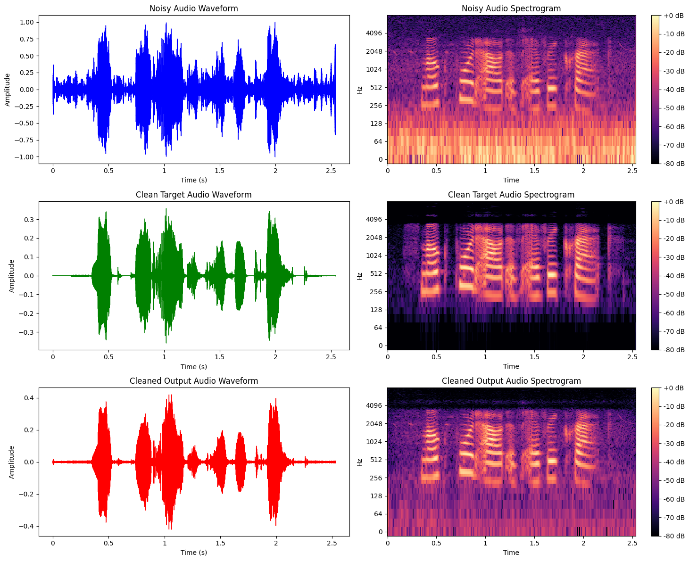
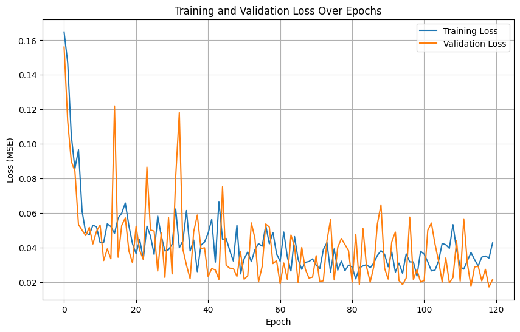

# Simple-Denoising-Using-Deep-Learning
Denoising of Speech Voice Using R-CNN (Recurrent-Convolutional Neural Network)

## Datasets Used for Training and Testing

This project utilizes three datasets as the core sources for model training and evaluation:

- **Audio Noise Dataset**  
  Source: `minsithu/audio-noise-dataset`  
  Provides diverse environmental noise samples.

- **Background Noise Dataset**  
  Source: `moazabdeljalil/back-ground-noise`  
  Adds additional ambient and background noise variations.

- **Speech Activity Detection Dataset**  
  Source: `lazyrac00n/speech-activity-detection-datasets`  
  Contains paired clean and noisy speech recordings for supervised learning and testing.

All three datasets are integrated throughout the training and testing pipeline to ensure broad noise coverage and realistic evaluation conditions.

## Results

### 1. Waveform and Spectrogram Comparison

The following visualization compares three stages of the audio pipeline:

- **Noisy Audio** – the raw input signal contaminated with environmental noise  
- **Clean Target Audio** – the ground-truth clean speech  
- **Cleaned Output Audio** – the model’s denoised output  

Each stage is shown both as a **waveform** and a **spectrogram**, allowing direct visual comparison of amplitude structure and frequency content.

  

---

### 2. Training and Validation Loss

The model was trained using MSE loss.  
The plot below shows the **training** and **validation** loss curves across epochs.  
Loss stabilizes with small fluctuations, indicating that the model continues learning without clear overfitting.

  

